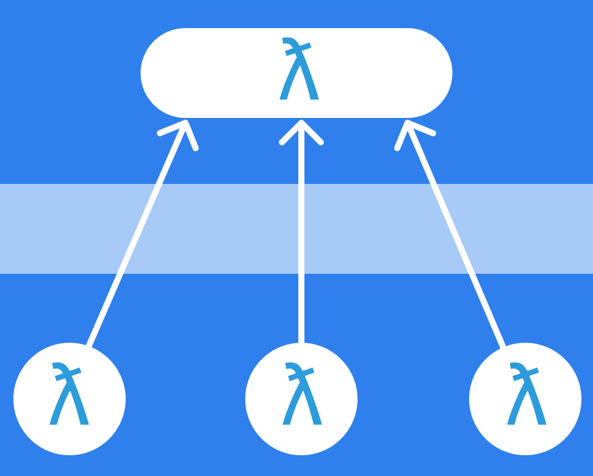

# BatchQL

[](https://nodei.co/npm/batchql/)
[](https://travis-ci.org/matthiasak/batchql)



GraphQL is awesome. It lets you query any client-side data and make mutations with a "type-safe" API. It talks to a single endpoint and allows you to query whatever data you need. You can achieve neat little queries like:

```js
gql(`
{
  user {
  	person(filter: {
      verified: false
    }){
      id
      name
      createdAt
    }
    adminOf(filter: {
      verified: false
    }){
      id
      name
      createdAt
    }
  }
}
`).then(({data:{data}) => {
	console.log(data) // {user: {person, adminOf}}...
	// or use with a React or other Virtual DOM `componentDidMount()` lifecycle method
	this.setState(data)
})
```

If you choose to create "Service Oriented Components", meaning your components can request their own data, such as with React Resolver, Mithril Resolver, or your own tiny built-in implementation, you run into sometimes 5 or 10 parallel graphql requests heading to your server:

```

  +----------------------------+
  |                            |
  |    header                  |  header -> `{ user { ...menuItems }}`
  |                            |
  |                            |
  |                            |
  +----------------------------+
  |                            |
  |  +-------------------------+
  |  |     ||     ||     ||   ||
  |  |  a  ||  b  ||  c  ||   ||  a, b, c, d, e -> `{ content(id:???) { title, date, summary } }
  |  |     ||     ||     ||   ||
  |  +--------------------|   ||
  |  +--------------------| e ||
  |  |                   ||   ||
  |  |                   ||   ||
  |  |        d          ||   ||
  |  |                   ||   ||
  |  |                   ||   ||
  |  +-------------------------|
  +----------------------------+

```

With the 6 queries above it could take a lot longer to get the data you need to render to the screen quickly. Fortunately these days we can abstract plain ol' function calls to some sort of shared state.

**This is what BatchQL does**.

Amongst your many components, they generate and request their own query structure from your GraphQL endpoints:

Query 1:

```gql
{
	user {
		orders {
			...orderData
		}
	}
}

fragment orderData on Order {
  createdAt
  billingAddress {
    ...addressData
  }
  shippingAddress {
    ...addressData
  }
  shippinghandling {
    description
    cost
  }
  # and so forth
}
```

Query 2:

```gql
{
  user {
    adminOf {
      name
      tags
      primaryColor
      secondaryColor
    }
    name
    email
    invitations {
      type
    }
    systemAdmin
    notifications {
      createdAt
      text
      title
      from
    }
    createdAt
    updatedAt
  }
}
```

Combined query sent to server:

```
fragment orderData on Order {
  createdAt
  billingAddress {
    ...addressData
  }
  shippingAddress {
    ...addressData
  }
  shippinghandling {
    description
    cost
  }
  # and so forth
}

query batchedQuery  {

	user0: user { orders { ...orderData } }

	user1: user { adminOf { name tags primaryColor secondaryColor } name email invitations { type } systemAdmin notifications { createdAt text title from } createdAt updatedAt }

	# and so forth :)

}
```

BatchQL treats your queries like they are meant to be: logically independent (as much as I could do in a few days' time :D). So, using BatchQL is pretty straightforward and hopefully not too leaky of an abstraction:

```js
// step 1. import batchql
// batchql :: (string -> object -> Promise) -> (string -> object -> Promise)
import batchql from 'batchql'

// step 2. create your function the posts to your graphql endpoint
const get = (url, query, args) =>
	fetch(
		url
		, {
			method: 'POST'
			, headers: Object.assign(
				{'Content-Type': 'application/json'}
				, token ? {'authorization': `Bearer ${token}`} : {})
			, body: JSON.stringify({ query, variables: args })
		})
		.then(r => r.json()))

// step 3. batch it!
const batchedGet = batchql(get.bind(null, 'https://mygraphqlendpoint.com/graphql'))

// step 4. use it err'where?
batchedGet(`{ user { id } }`).then(response => console.log(response.data.user))
batchedGet(`{ notifications { comments } }`).then(response => console.log(response.data.comments))
batchedGet(`{ messages { text, from } }`).then(response => console.log(response.data.messages))
```

## Usage

```sh
yarn add batchql
# or
npm install --save batchql
```

## Caught a bug?

1. [Fork](https://help.github.com/articles/fork-a-repo/) this repository to your own GitHub account and then [clone](https://help.github.com/articles/cloning-a-repository/) it to your local device
2. Install the dependencies: `yarn`
3. Bundle the source code and watch for changes: `npm start`

After that, you'll find the code in the `./build` folder!

## Notes

- I couldn't get the `graphql-tag` parser/AST to work for me this go around, so this is a limited subset of batching features using RegEx and good ol' pure JS. In the future I can do a lot more eloquent tree combinations with an AST once I get that working. For now, the code will not scope and map the names of graphql query arguments to the single batched query, so if possible I recommend sending args as embedded inputs to the query strings instead of as a separate object.
- Selection names are multiplexed, mapped, and then demux'ed upon return, so the data a query requested is scoped to it's `Promise.resolve()`.
- Fragments will be extracted from all queries and placed at the top of the batched query.
- Mutations need to be handled regularly, and I haven't built an auto-scheduler into the library yet but I have plans to support mutations through the batched method soon. For now, just use a regular `POST /graphql` with `fetch()` or `axios` or w/e you prefer for mutations.

## Authors

- Matthew Keas, [@matthiasak](https://twitter.com/@matthiasak). Need help / support? Create an issue or ping on Twitter.
